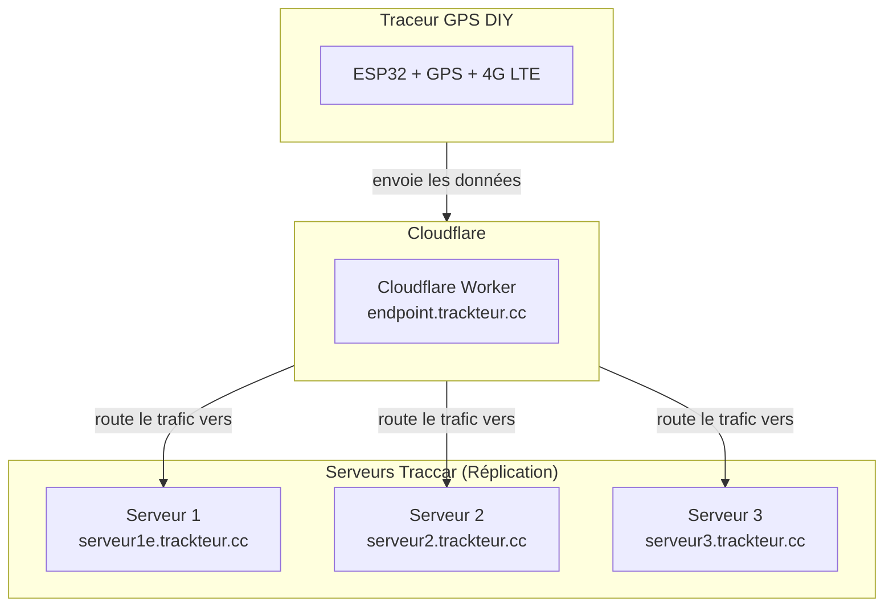

# Trackteur


Système de traceur GPS DIY pour le suivi de véhicules et équipements agricoles. Ce projet documente la création et le déploiement d'un système de suivi GPS complet, depuis le matériel jusqu'à l'infrastructure serveur.

## Vue d'ensemble de l'infrastructure

L'architecture est conçue pour être résiliente et évolutive, en s'appuyant sur des services cloud modernes pour le routage et l'hébergement.



## Composants

| Composant | Description |
|-----------|-------------|
| **Traceur GPS DIY** | Appareil basé sur LilyGo T-A7670G (ESP32) équipé d'un module GPS et cellulaire 4G/LTE pour collecter et transmettre les coordonnées en temps réel. |
| **Cloudflare Worker** | Point d'entrée unique qui réplique les données vers plusieurs serveurs Traccar, assurant une redondance des données. |
| **Serveurs Traccar** | Instances indépendantes du serveur Traccar en Docker. Port 5055 pour OsmAnd, port 8082 pour l'interface web. |
| **Carte SIM Hologram** | Connectivité IoT mondiale avec roaming automatique et tarification optimisée. |

## Caractéristiques du firmware

- **Intervalle d'envoi**: 2 minutes (configurable)
- **Timeout GPS**: 1 minute sans fix → sleep automatique
- **Protocole**: OsmAnd (HTTPS)
- **Backup SD**: Sauvegarde CSV si échec réseau
- **Multi-constellation**: GPS, GLONASS, BeiDou, Galileo
- **Mode veille**: Modem sleep entre transmissions (2-3 mA)

## Navigation

| Guide | Description |
|-------|-------------|
| [BOM (Liste des composants)](docs/BOM.md) | Liste du matériel nécessaire |
| [Fabrication du traceur GPS](docs/fabrication_traceur_gps.md) | Instructions pour assembler le matériel |
| [Programmation du LilyGo A7670G](docs/programmation_liligo_a7670g.md) | Guide pour flasher le firmware |
| [Déploiement des serveurs Traccar](docs/installation_docker.md) | Mise en place des serveurs avec Docker |
| [Configuration de Cloudflare](docs/configuration_cloudflare.md) | Mise en place du tunnel et du Worker |
| [Création de carte SIM Hologram](docs/creation_carte_sim_hologram.md) | Pour la connectivité cellulaire |
| [Installation dans un véhicule](docs/installation_vehicule.md) | Conseils pour l'installation physique |

## Installation rapide

### 1. Configuration firmware

Éditer `code/TraccarGPS/config.h`:

```cpp
#define TRACCAR_DEVICE_ID    "TRACTEUR_001"
#define TRACCAR_SERVER_URL   "https://endpoint.trackteur.cc"
#define NETWORK_APN          "hologram"
```

### 2. Compilation et upload

```bash
arduino-cli compile --fqbn esp32:esp32:esp32 code/TraccarGPS/
arduino-cli upload --fqbn esp32:esp32:esp32 --port /dev/ttyACM0 code/TraccarGPS/
```

### 3. Déploiement serveur

```bash
docker-compose up -d
```

## Structure du projet

```
trackteur/
├── code/TraccarGPS/        # Firmware Arduino
├── docs/                   # Documentation MkDocs
├── docker-compose.yml      # Déploiement serveurs
└── mkdocs.yml              # Configuration documentation
```

## Documentation en ligne

La documentation complète est disponible sur [https://trackteur.cc](https://trackteur.cc)

## Licence

MIT License

## Remerciements

- [LilyGo](https://github.com/Xinyuan-LilyGO) - Module T-A7670G et fork TinyGSM
- [Traccar](https://www.traccar.org/) - Plateforme de tracking open-source
- [Hologram](https://www.hologram.io/) - Connectivité IoT globale
