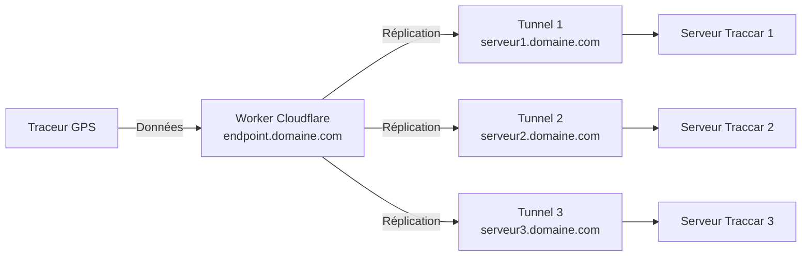

# Configuration de Cloudflare

Ce guide explique comment configurer Cloudflare pour exposer vos serveurs Traccar et créer le Worker qui réplique les données GPS vers tous les serveurs.

## Prérequis

- Un compte Cloudflare actif
- Un nom de domaine enregistré et géré par Cloudflare
- Serveurs Traccar déployés et fonctionnels

## Architecture



## 1. Créer les tunnels Cloudflare (pour chaque serveur)

Répétez ces étapes pour chaque serveur Traccar.

### 1.1 Créer le fichier `.env`

Le service `cloudflared` a besoin d'un token de tunnel pour s'authentifier.

```bash
touch .env
```

Ajoutez votre token de tunnel :

```
TUNNEL_TOKEN=<VOTRE_TOKEN_DE_TUNNEL_CLOUDFLARE>
```

### 1.2 Créer le tunnel sur Cloudflare

1. Sur le dashboard Cloudflare, vérifiez que votre domaine est géré par Cloudflare
2. Rendez-vous dans **Zero Trust → Networks → Tunnels**
3. Cliquez sur **Add a tunnel / Create a tunnel**
4. Choisissez **Docker** comme méthode d'installation
5. Copiez le token fourni et collez-le dans votre fichier `.env`
6. Dans **Public Hostnames**, créez un enregistrement :
   - **Subdomain** : `serveur1` (ou `serveur2`, `serveur3`, etc.)
   - **Domain** : Votre domaine
   - **Service** : `HTTP` et `http://traccar:8082`
7. Enregistrez le tunnel

### 1.3 Démarrer les services

```bash
sudo docker-compose up -d
```

## 2. Créer le Worker Cloudflare

Le Worker reçoit les données GPS du traceur et les réplique vers tous les serveurs Traccar simultanément.

### 2.1 Créer le Worker

1. Sur le dashboard Cloudflare, allez dans **Workers et Pages**
2. Cliquez sur **Create Worker**
3. Donnez un nom au Worker (ex: `traccar-replicator`)
4. Cliquez sur **Deploy**

### 2.2 Configurer le code du Worker

1. Cliquez sur **Edit code**
2. Remplacez le contenu par :

```javascript
export default {
  async fetch(request, env, ctx) {
    const targets = [
      env.TRACCAR_A,
      env.TRACCAR_B,
      env.TRACCAR_C,
    ];

    const url = new URL(request.url);
    const method = request.method;

    const queryString = url.search; // garde ?id=...&lat=...
    const body = await request.arrayBuffer();

    const headers = new Headers(request.headers);
    headers.delete("Host");
    headers.delete("Content-Length");

    const promises = targets.map(async (baseUrl) => {
      if (!baseUrl) {
        return { target: baseUrl, ok: false, error: "missing target" };
      }

      const targetUrl = baseUrl + queryString;

      try {
        const resp = await fetch(targetUrl, {
          method,
          headers,
          body: method === "GET" ? undefined : body,
        });
        return { target: targetUrl, ok: resp.ok, status: resp.status };
      } catch (e) {
        return { target: targetUrl, ok: false, error: String(e) };
      }
    });

    ctx.waitUntil(
      (async () => {
        const results = await Promise.all(promises);
        console.log("Traccar fan-out results", JSON.stringify(results));
      })()
    );

    return new Response("OK\n", { status: 200, headers: { "Content-Type": "text/plain" } });
  },
};
```

3. Cliquez sur **Save and Deploy**

### 2.3 Configurer les variables d'environnement

1. Allez dans l'onglet **Settings** du Worker
2. Dans **Variables and Secrets**, ajoutez les variables suivantes :

| Type | Nom | Valeur |
|------|-----|--------|
| Text | `TRACCAR_A` | `https://serveur1.votredomaine.com` |
| Text | `TRACCAR_B` | `https://serveur2.votredomaine.com` |
| Text | `TRACCAR_C` | `https://serveur3.votredomaine.com` |

3. Cliquez sur **Save**

### 2.4 Configurer le domaine personnalisé

1. Allez dans l'onglet **Domains & Routes** du Worker
2. Cliquez sur **Add** → **Custom Domain**
3. Entrez le sous-domaine pour le point d'entrée GPS (ex: `gps.votredomaine.com`)
4. Cliquez sur **Add Domain**

## 3. Configurer le traceur GPS

Dans la configuration du traceur (fichier `config.h`), utilisez l'URL du Worker :

```cpp
#define TRACCAR_SERVER_URL "https://gps.votredomaine.com"
```

Le traceur enverra ses données au Worker, qui les répliquera automatiquement vers tous les serveurs Traccar.

## Notes utiles

- Le Worker répond toujours `OK` au traceur, même si certains serveurs sont indisponibles
- Les logs du Worker (accessibles dans **Observability**) montrent le résultat de chaque réplication
- Vous pouvez ajouter ou retirer des serveurs en modifiant les variables d'environnement
