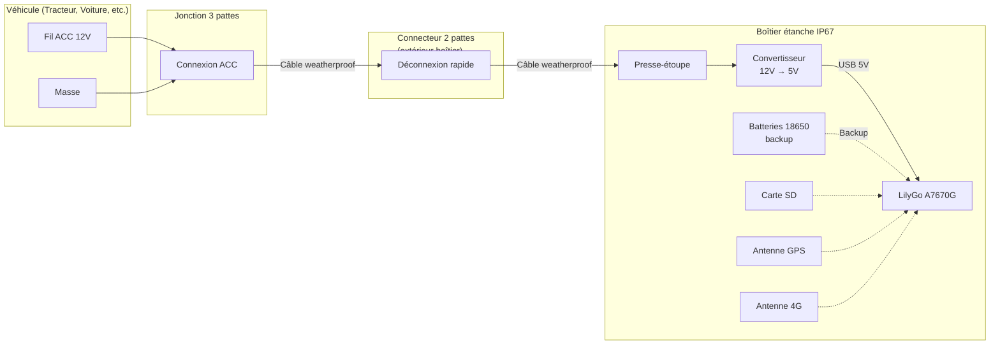

# Fabrication du traceur GPS

Ce guide détaille l'assemblage mécanique du traceur GPS Trackteur.

## Matériel requis

Référez-vous au [BOM (Bill of Materials)](BOM.md) pour la liste complète des composants avec images.

## Schéma de câblage

### Légende

- **Trait plein** : Connexions d'alimentation
- **Trait pointillé** : Connexions internes au boîtier

## Étapes d'assemblage

### Étape 1 : Préparation du boîtier

1. Percez un trou dans le boîtier pour le presse-étoupe (diamètre selon PG7 ou PG9)
2. Installez le presse-étoupe et serrez-le pour assurer l'étanchéité

### Étape 2 : Préparation du câblage d'alimentation

1. Passez le câble weatherproof à travers le presse-étoupe
2. À l'intérieur du boîtier :
   - Connectez les fils du câble au convertisseur 12V-5V (entrée)
   - Connectez la sortie 5V du convertisseur au port USB du LilyGo
3. À l'extérieur du boîtier :
   - Installez le connecteur 2 pattes weatherproof sur le câble (côté mâle)

### Étape 3 : Préparation du LilyGo

1. Installez les batteries 18650 dans le support du LilyGo
2. Insérez la carte SIM dans le slot du LilyGo
3. Insérez la carte SD 16 Go pour le backup des données GPS
4. Connectez les antennes GPS et 4G au module

### Étape 4 : Installation des composants dans le boîtier

Tous les composants sont fixés au fond du boîtier avec des tie-wraps :

1. **LilyGo A7670G** (avec batteries déjà installées) : Fixez-le solidement avec 2-3 tie-wraps
2. **Convertisseur 12V-5V** : Fixez-le à côté du LilyGo

### Étape 5 : Préparation du câble côté véhicule

1. Installez le connecteur 2 pattes weatherproof (côté femelle) sur un nouveau segment de câble
2. À l'autre extrémité, connectez la jonction 3 pattes weatherproof
3. La jonction 3 pattes servira à raccorder le câble aux fils ACC (12V) du véhicule

## Installation dans le véhicule

### Connexion électrique

1. Identifiez un fil ACC (accessoires) 12V dans le véhicule
   - Ce fil est alimenté uniquement quand le contact est mis
   - Idéal pour tracteurs, voitures, camions, etc.
2. Utilisez la jonction 3 pattes pour vous raccorder aux fils ACC (+12V et masse)

### Fixation du boîtier

1. Choisissez un emplacement discret et protégé dans le véhicule
2. Fixez le boîtier avec des tie-wraps sur un support existant
3. Assurez-vous que les antennes GPS et 4G ont une bonne réception

### Connexion finale

1. Branchez le connecteur 2 pattes pour alimenter le traceur
2. Le connecteur externe permet de retirer facilement le traceur pour maintenance ou changement de véhicule

## Vérification

1. Mettez le contact du véhicule
2. Vérifiez que le LilyGo s'allume (LED)
3. Attendez l'acquisition GPS (peut prendre 1-2 minutes au premier démarrage)
4. Vérifiez sur votre serveur Traccar que les positions sont reçues

## Conseils

- Gardez les antennes à l'intérieur du boîtier mais orientées vers le haut pour une meilleure réception
- Si possible, placez le boîtier près du pare-brise ou dans un endroit avec vue dégagée vers le ciel
- Le boîtier étanche IP65/IP67 protège contre la poussière et les projections d'eau
