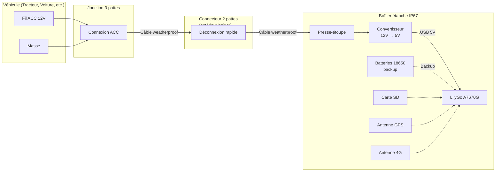

# Fabrication du traceur GPS

Ce guide détaille l'assemblage mécanique du traceur GPS Trackteur.

## Matériel requis

Référez-vous au [BOM (Bill of Materials)](BOM.md) pour la liste complète des composants avec images.

## Schéma de câblage

```mermaid
flowchart LR
    subgraph vehicule["Véhicule (Tracteur, Voiture, etc.)"]
        ACC[Fil ACC 12V]
        GND[Masse]
    end

    subgraph jonction["Jonction 3 pattes"]
        J[Connexion ACC]
    end

    subgraph connecteur["Connecteur 2 pattes<br/>(extérieur boîtier)"]
        C[Déconnexion rapide]
    end

    subgraph boitier["Boîtier étanche IP67"]
        PE[Presse-étoupe]
        CONV[Convertisseur<br/>12V → 5V]
        LILYGO[LilyGo A7670G]
        BAT[Batteries 18650<br/>backup]
        SD[Carte SD]
        ANT1[Antenne GPS]
        ANT2[Antenne 4G]
    end

    ACC --> J
    GND --> J
    J -->|Câble weatherproof| C
    C -->|Câble weatherproof| PE
    PE --> CONV
    CONV -->|USB 5V| LILYGO
    BAT -.->|Backup| LILYGO
    SD -.-> LILYGO
    ANT1 -.-> LILYGO
    ANT2 -.-> LILYGO
```

### Légende

- **Trait plein** : Connexions d'alimentation
- **Trait pointillé** : Connexions internes au boîtier

## Étapes d'assemblage

### Étape 1 : Préparation du boîtier

1. Percez un trou dans le boîtier pour le presse-étoupe (diamètre de 12.5mm ou 1/2 pouce)

2. Installez le presse-étoupe et serrez-le pour assurer l'étanchéité

### Étape 2 : Installation des composants dans le boîtier
1. Poser les pattes autocollantes dans les trous du LilygoA7670G et retirer la pellicule verte.

2. Brancher l'antenne LTE autocollante

3. Brancher l'antenne GPS

4. Brancher le câble d'alimentation

5. Coller le Lilygo A7670G au fond du boîtier. Le place environ au centre.

6. Coller l'antenne LTE sur la paroi du boîtier

7. Coller l'antenne GPS à l'aide du ruban double-face, mettre 3 couches de ruban double face.

8. Coller le bloc d'alimentation au fond du boîtier à l'aide du ruban double face, une couche suffit ici.

9. Insérer le fil d'alimentation à travers le presse-étoupe

10. Dénuder le fil d'alimentation

11. Étamer les bouts de fils dénudés.

12. Souder avec les fils correspondandts du bloc d'alimentation

13. Mettre du ruban électrique autour des fils soudés

14. Sécuriser à l'aide de tie-wrap les fils au fond du boîtier

15. C'est terminé!

