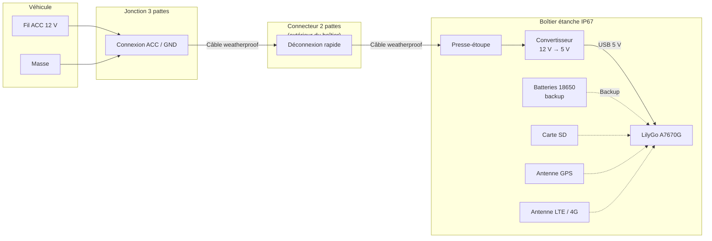

# Fabrication du traceur GPS Trackteur

Ce guide présente l’assemblage mécanique et le câblage de base du traceur GPS **Trackteur**.

## 1. Matériel requis

Référez-vous au [BOM — Bill of Materials](BOM.md) pour la liste complète des composants avec images.

## 2. Vue d’ensemble du système

Le traceur est installé dans un boîtier étanche IP67. Il est alimenté par le véhicule via le fil ACC 12 V et la masse. Un convertisseur abaisse la tension de 12 V vers 5 V pour alimenter le module LilyGo A7670G.

Le connecteur externe permet de débrancher rapidement le traceur sans ouvrir le boîtier.

## 3. Schéma de câblage

```mermaid
flowchart LR
    subgraph vehicule["Véhicule"]
        ACC[Fil ACC 12 V]
        GND[Masse]
    end

    subgraph jonction["Jonction 3 pattes"]
        J[Connexion ACC / GND]
    end

    subgraph connecteur["Connecteur 2 pattes<br/>(extérieur du boîtier)"]
        C[Déconnexion rapide]
    end

    subgraph boitier["Boîtier étanche IP67"]
        PE[Presse-étoupe]
        CONV[Convertisseur<br/>12 V → 5 V]
        LILYGO[LilyGo A7670G]
        BAT[Batteries 18650<br/>backup]
        SD[Carte SD]
        ANT1[Antenne GPS]
        ANT2[Antenne LTE / 4G]
    end

    ACC --> J
    GND --> J
    J -->|Câble weatherproof| C
    C -->|Câble weatherproof| PE
    PE --> CONV
    CONV -->|USB 5 V| LILYGO
    BAT -.->|Backup| LILYGO
    SD -.-> LILYGO
    ANT1 -.-> LILYGO
    ANT2 -.-> LILYGO
```

### Légende

* **Trait plein** : connexions d’alimentation
* **Trait pointillé** : connexions internes au boîtier

## 4. Préparation du boîtier

### 4.1 Percer le trou pour le presse-étoupe

Percer un trou dans le boîtier pour installer le presse-étoupe.

Diamètre recommandé :

* **12,5 mm**
* ou **1/2 po**

### 4.2 Installer le presse-étoupe

Installer le presse-étoupe dans le trou, puis le serrer afin d’assurer l’étanchéité.

## 5. Préparation du module LilyGo A7670G

### 5.1 Installer les pattes autocollantes

Poser les pattes autocollantes dans les trous du LilyGo A7670G, puis retirer la pellicule verte.

### 5.2 Brancher l’antenne LTE

Brancher l’antenne LTE autocollante sur le module LilyGo.

### 5.3 Brancher l’antenne GPS

Brancher l’antenne GPS sur le module LilyGo.

### 5.4 Brancher le câble d’alimentation

Brancher le câble d’alimentation au module LilyGo.

## 6. Installation des composants dans le boîtier

### 6.1 Coller le LilyGo dans le boîtier

Coller le LilyGo A7670G au fond du boîtier, environ au centre.

### 6.2 Coller l’antenne LTE

Coller l’antenne LTE sur une paroi intérieure du boîtier.

### 6.3 Coller l’antenne GPS

Coller l’antenne GPS à l’aide de ruban double-face.

Utiliser **3 couches de ruban double-face**.

### 6.4 Coller le bloc d’alimentation

Coller le bloc d’alimentation au fond du boîtier à l’aide de ruban double-face.

Une seule couche de ruban double-face suffit pour cette pièce.

## 7. Passage et préparation du fil d’alimentation

### 7.1 Insérer le fil dans le presse-étoupe

Insérer le fil d’alimentation à travers le presse-étoupe.

### 7.2 Dénuder le fil d’alimentation

Dénuder les conducteurs du fil d’alimentation.

### 7.3 Étamer les fils

Étamer les bouts des fils dénudés.

## 8. Connexion au bloc d’alimentation

### 8.1 Souder les fils

Souder les fils du câble d’alimentation aux fils correspondants du bloc d’alimentation.

### 8.2 Isoler les soudures

Mettre du ruban électrique autour des fils soudés afin d’isoler les connexions.

## 9. Finition du montage

### 9.1 Sécuriser les fils

Sécuriser les fils au fond du boîtier à l’aide de tie-wraps.

### 9.2 Vérification finale

Avant de refermer le boîtier, vérifier que :

* le LilyGo A7670G est solidement fixé;
* les antennes GPS et LTE sont branchées;
* le câble d’alimentation est bien retenu par le presse-étoupe;
* les soudures sont isolées;
* les fils ne bougent pas librement dans le boîtier;
* rien ne force sur les connecteurs du LilyGo.

## 10. Montage terminé

Le traceur GPS Trackteur est maintenant assemblé.

