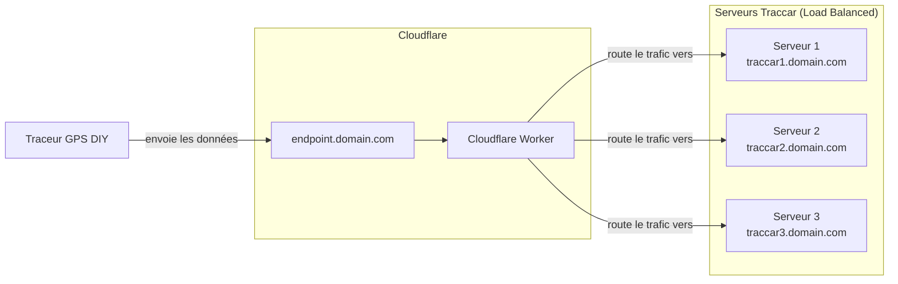

# Trackteur - Un projet de traceur GPS DIY

Ce projet documente la création et le déploiement d'un système de suivi GPS complet, depuis le matériel jusqu'à l'infrastructure serveur.

## Vue d'ensemble de l'infrastructure

L'architecture est conçue pour être résiliente et évolutive, en s'appuyant sur des services cloud modernes pour le routage et l'hébergement.

### Composants

1.  **Traceur GPS DIY**: Un appareil basé sur un microcontrôleur (ESP32) équipé d'un module GPS et cellulaire (GSM/LTE) pour collecter et transmettre les coordonnées en temps réel.
2.  **Cloudflare Worker**: Agit comme un point d'entrée unique (`endpoint.domain.com`) et un répartiteur de charge (load balancer). Il reçoit les données du traceur et les redirige de manière transparente vers l'un des serveurs Traccar disponibles.
3.  **Serveurs Traccar**: Trois instances indépendantes du serveur Traccar, chacune fonctionnant sur son propre sous-domaine (`traccar1.domain.com`, etc.). Chaque serveur expose :
    -   Le port `5055` pour le protocole OsmAnd, utilisé par les traceurs.
    -   Le port `8082` pour l'interface web de Traccar.

## Navigation

-   **[Fabrication du traceur GPS](fabrication_traceur_gps.md)**: Instructions pour assembler le matériel.
-   **[Programmation du Liligo A7670G](programmation_liligo_a7670g.md)**: Guide pour flasher le firmware du traceur.
-   **[Déploiement des serveurs Traccar](installation_docker.md)**: Comment mettre en place les serveurs Traccar avec Docker.
-   **[Configuration de Cloudflare](configuration_cloudflare.md)**: Mise en place du tunnel et du Worker.
-   **[Création de carte SIM Hologram](creation_carte_sim_hologram.md)**: Pour la connectivité cellulaire.
-   **[Installation dans un véhicule](installation_vehicule.md)**: Conseils pour l'installation physique du traceur.
