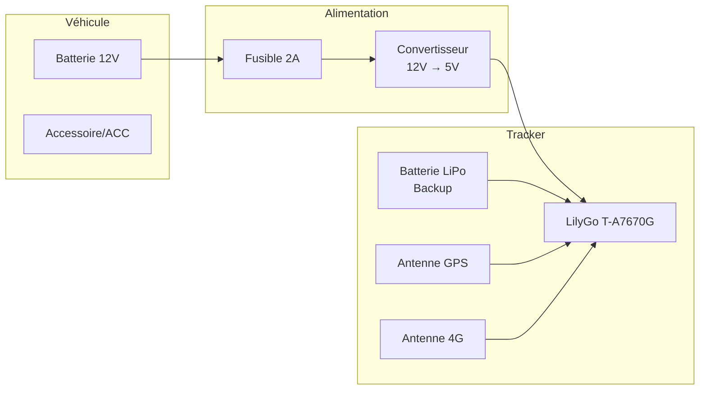

# Installation dans le véhicule

Guide pour installer le tracker GPS dans un tracteur ou véhicule agricole.

## Vue d'ensemble



## Matériel requis

| Composant | Spécification | Quantité |
|-----------|---------------|----------|
| Convertisseur DC-DC | 12V → 5V, 3A min | 1 |
| Fusible | 2A, porte-fusible | 1 |
| Câble alimentation | 18 AWG, 2m | 1 |
| Boîtier étanche | IP65 minimum | 1 |
| Connecteur USB-C | Coudé 90° | 1 |
| Serre-câbles | Assortis | 10+ |
| Ruban auto-vulcanisant | Pour étanchéité | 1 |
| Cosse à sertir | Pour batterie | 2 |

## Choix de l'emplacement

### Critères

1. **Réception GPS**: Vue dégagée du ciel
2. **Signal 4G**: Pas de blindage métallique
3. **Protection**: À l'abri de l'eau et vibrations
4. **Accessibilité**: Pour maintenance
5. **Discrétion**: Non visible (anti-vol)

### Emplacements recommandés

#### Tracteur
- **Sous le capot**: Près du pare-brise (bonne réception)
- **Derrière le tableau de bord**: Protégé, accès facile
- **Dans la cabine**: Sous le siège ou derrière le panneau

#### Véhicule utilitaire
- **Sous le tableau de bord**: Côté passager
- **Dans le coffre**: Sous le tapis
- **Pare-chocs**: Avec boîtier étanche

## Installation électrique

### Schéma de câblage

```
Batterie 12V (+) ──┬── Fusible 2A ── DC-DC IN+ ── DC-DC OUT+ ── USB-C 5V
                   │
Masse véhicule ────┴── DC-DC IN- ──────────────── DC-DC OUT- ── USB-C GND
```

### Étapes

1. **Déconnecter la batterie** du véhicule (sécurité)

2. **Installer le fusible**
   - Connecter au + batterie ou borne accessoire
   - Fusible 2A pour protéger le circuit

3. **Connecter le convertisseur DC-DC**
   ```
   IN+  → Fusible → Batterie +12V
   IN-  → Masse véhicule
   OUT+ → USB-C rouge (5V)
   OUT- → USB-C noir (GND)
   ```

4. **Vérifier la tension**
   - Mesurer la sortie: doit être 5V ± 0.25V
   - Vérifier sans charge puis avec le tracker

5. **Reconnecter la batterie** du véhicule

### Option: Alimentation ACC

Pour éteindre le tracker quand le véhicule est arrêté:
- Connecter IN+ sur la ligne accessoire (ACC)
- Le tracker s'éteint avec le contact
- La batterie LiPo prend le relais brièvement

## Installation des antennes

### Antenne GPS

**Position critique** - Doit voir le ciel!

1. **Montage magnétique** (recommandé)
   - Placer sur le toit métallique
   - Câble passé par joint de porte

2. **Montage intérieur**
   - Sous le pare-brise, côté passager
   - Performance réduite (~30%)

3. **Montage adhésif**
   - Sur tableau de bord, face vers le haut
   - Éviter les pare-brises athermiques

### Antenne 4G

Moins critique que le GPS:

1. À l'intérieur du boîtier: OK si plastique
2. Externe: Meilleure réception en zone rurale
3. Éviter: Boîtiers métalliques fermés

## Montage du boîtier

### Préparation

1. Percer les trous pour:
   - Passage câble alimentation
   - Passage câbles antennes (si externes)

2. Étanchéifier avec:
   - Presse-étoupes IP68
   - Ou ruban auto-vulcanisant

### Fixation

1. **Velcro industriel**: Facile à retirer
2. **Serre-câbles**: Sur structure existante
3. **Vis**: Sur surface plane (attention vibrations)

### Protection vibrations

- Mousse EVA sous le tracker
- Éviter contact direct avec métal
- Serre-câbles avec amortisseurs

## Vérification post-installation

### Checklist

- [ ] Alimentation: LED allumée sur le tracker
- [ ] Tension: 5V stable au multimètre
- [ ] GPS: Fix obtenu en < 2 minutes
- [ ] 4G: Connexion réseau établie
- [ ] Transmission: Position visible sur Traccar
- [ ] Étanchéité: Pas d'entrée d'eau possible
- [ ] Fixation: Tracker bien attaché
- [ ] Antennes: Bien connectées et positionnées

### Test fonctionnel

1. Démarrer le véhicule
2. Attendre 2-3 minutes
3. Vérifier sur Traccar:
   - Position correcte
   - Vitesse cohérente
   - Timestamp récent

4. Faire un trajet test de 10 min
5. Vérifier la trace GPS sur la carte

## Dépannage terrain

### Pas de fix GPS

- Repositionner l'antenne GPS (vue du ciel)
- Vérifier la connexion antenne (SMA bien vissé)
- Attendre 5 min pour cold start

### Pas de connexion 4G

- Vérifier la couverture réseau (téléphone)
- Repositionner l'antenne 4G
- Vérifier la carte SIM (bien insérée)

### Redémarrages fréquents

- Vérifier la tension d'alimentation (5V stable)
- Ajouter condensateur 1000µF sur l'alimentation
- Vérifier les connexions (vibrations)

### Tracker ne démarre pas

- Vérifier le fusible
- Mesurer la tension entrée/sortie DC-DC
- Tester avec alimentation USB directe

## Maintenance

### Mensuelle
- Vérifier la fixation
- Nettoyer les antennes
- Vérifier les connexions

### Annuelle
- Inspecter le boîtier (étanchéité)
- Vérifier l'état de la batterie LiPo
- Mettre à jour le firmware si nécessaire

## Considérations légales

- **Véhicules personnels**: Installation libre
- **Véhicules d'entreprise**: Informer les conducteurs
- **Véhicules de location**: Vérifier la réglementation locale
- **Sénégal**: Pas de restriction connue pour usage privé

## Photos d'installation type

*À compléter avec photos du projet*

1. Vue d'ensemble du montage
2. Connexion alimentation
3. Position antenne GPS
4. Boîtier fermé installé
